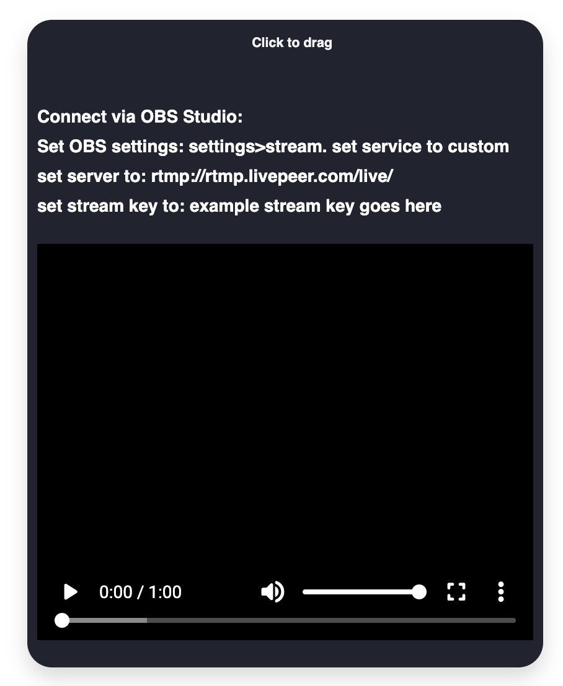
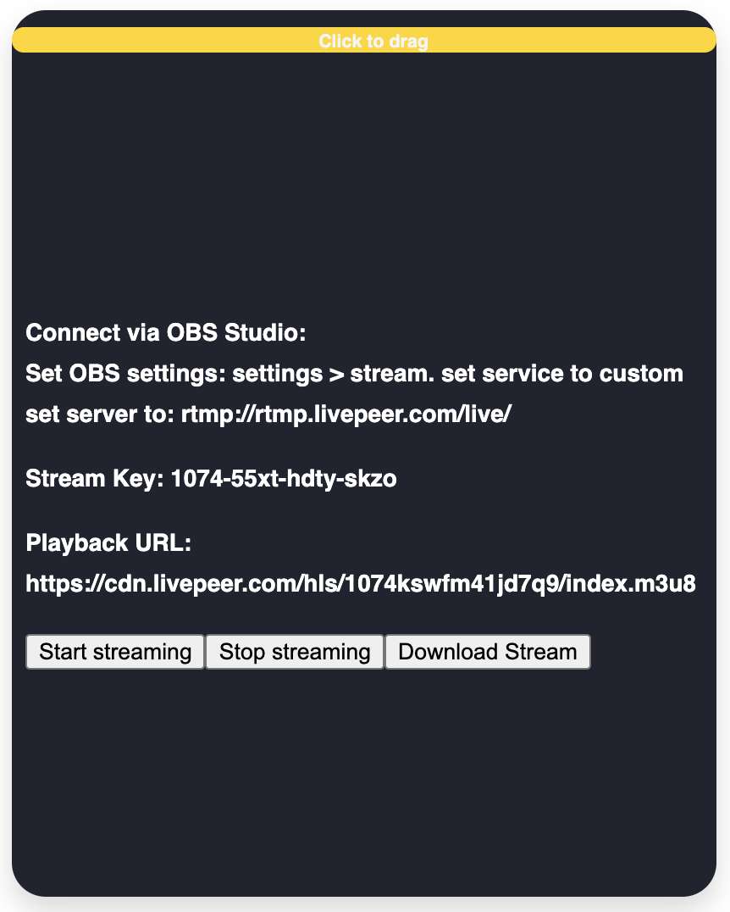
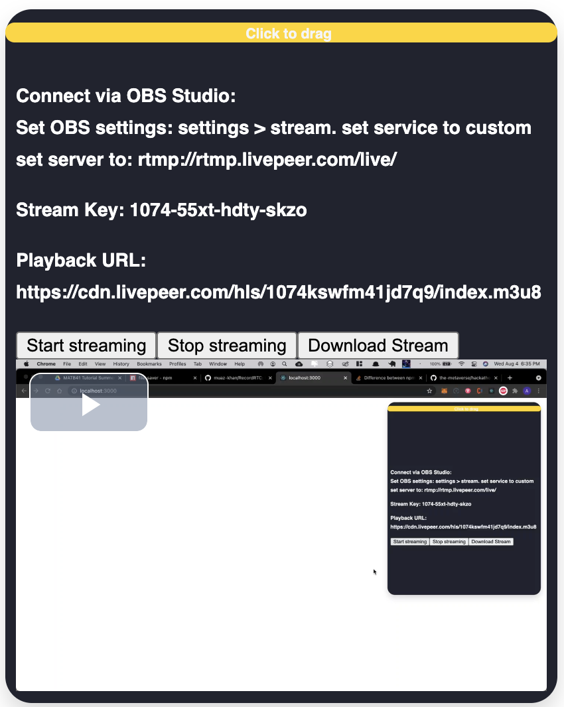
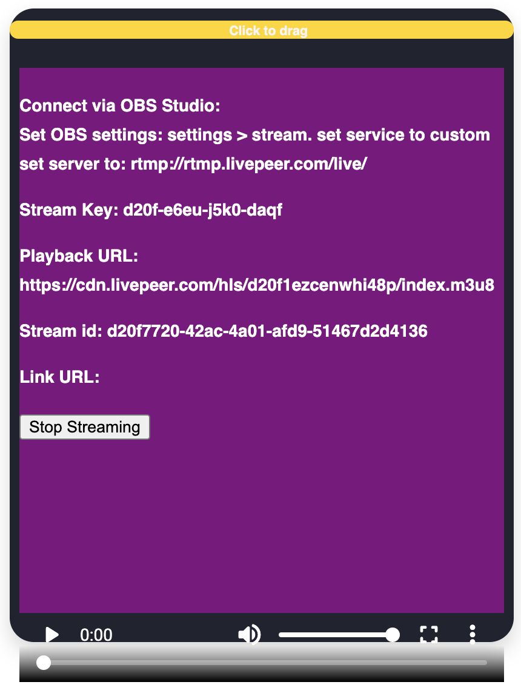
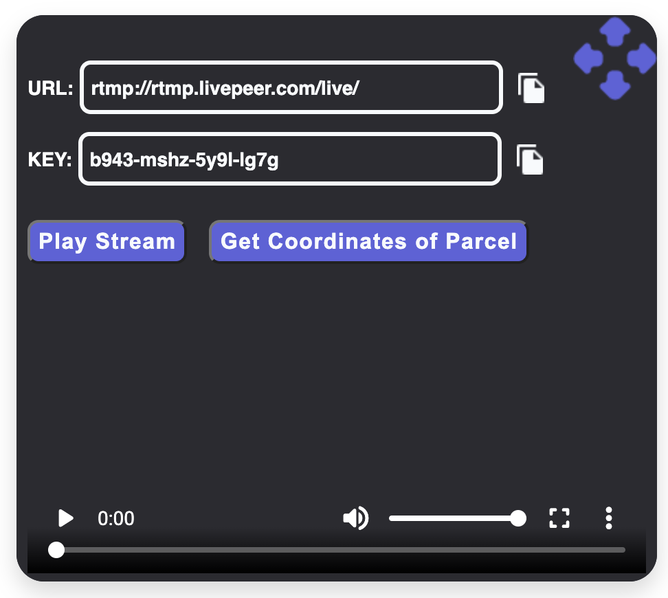
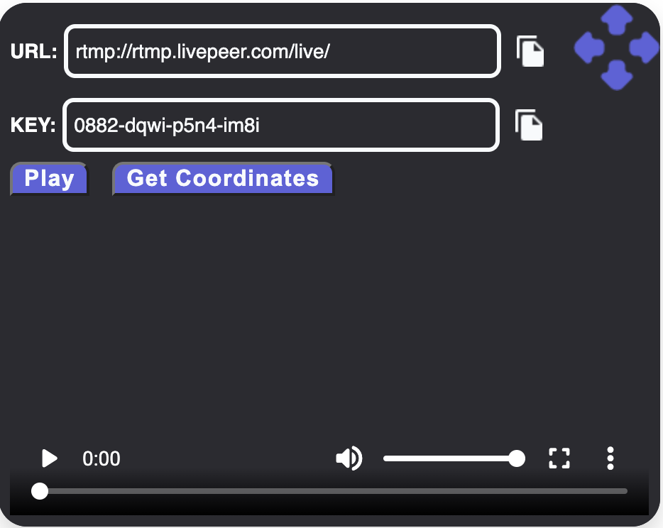
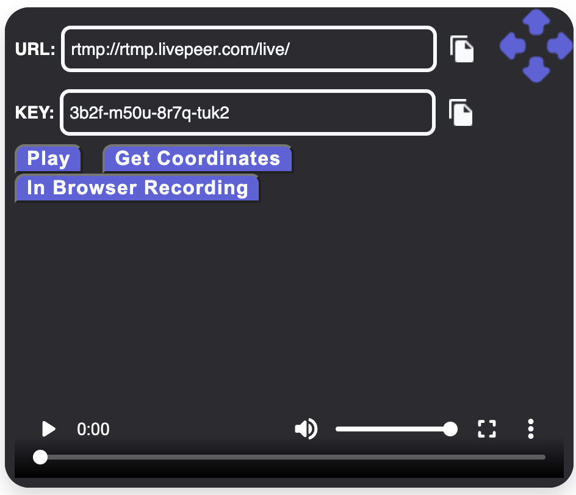

# hackathon
## WeMeta parcel streams integration with livepeer
ETH Global's HackFS

## Description
Upon opening the browser extension, you are presented with a URL and a KEY.  
These are the credentials needed to plug into OBS. Settings->Stream then for  
server, put in URL and for stream key, put in KEY. This will allow you to start  
 your stream and end your stream. After the stream processes which can take  
 around 5 minutes, the stream can be played by clicking Play Stream. To store  
 the coordinates, click Get Coordinates which will pull the coordinates from  
 the url of the metaverse you are playing in. Currently supported for  
 decentraland and cryptovoxels. The button for in browser streaming is an  
 alternate way to stream straight from your browser if OBS is something  
 you don't want to use.  

## Visuals

[Boiler Plate Code Repo](https://github.com/upmostly/react-chrome-extension.git)

[Video Player Repo](https://github.com/google/shaka-player)

[Alt Video Player Repo](https://github.com/video-react/video-react)

[Audio/Video Repo](https://github.com/muaz-khan/RecordRTC)

[File saver Repo](https://github.com/eligrey/FileSaver.js)

[Styled components Repo](https://github.com/styled-components/styled-components)

[Stream in-browser solution](https://github.com/carrabre/landpeer-stream)

## How to run locally:
### 1. `git clone https://github.com/the-metaverse/hackathon.git`
### 2. change directory to hackathon
### 3. create livepeer api key
### 4. `npm i`
### 5. `npm start`
### 6. change directory to landpeer-stream
### 7. `npm run dev`

TODO: 
- change text to link (visit site to set up OBS)
- add link to create API key to connect
- style input box
- rearrange content on window

[LICENSE](LICENSE)
