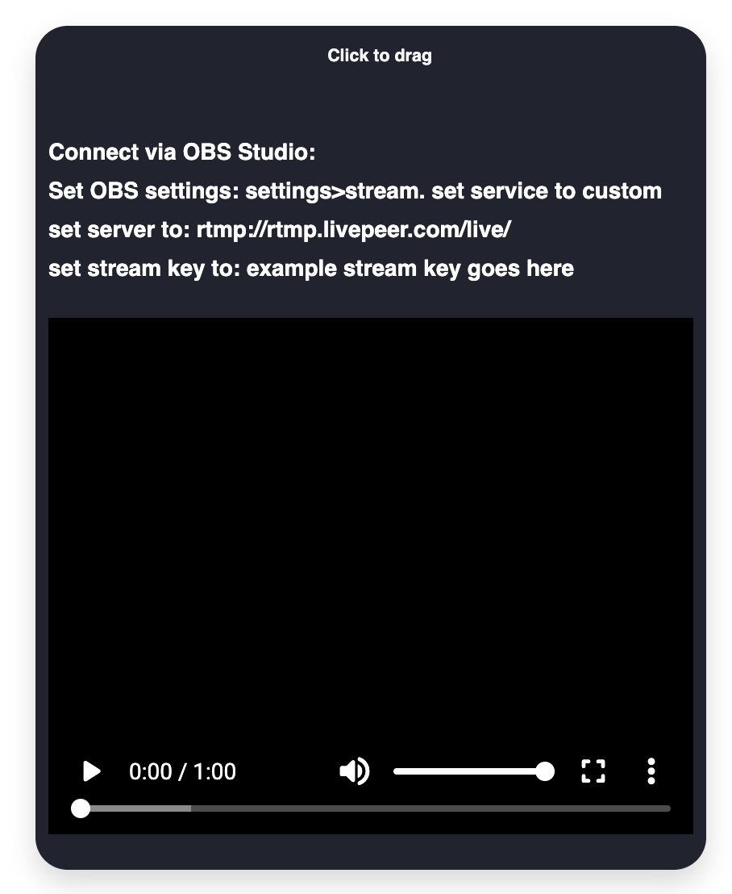

# hackathon
## WeMeta parcel streams integration with livepeer
ETH Global's HackFS

## Visuals

[Boiler Plate Code Repo](https://github.com/upmostly/react-chrome-extension.git)

[Video Player Repo](https://github.com/google/shaka-player)

[Alt Video Player Repo](https://github.com/video-react/video-react)

[Audio/Video Repo](https://github.com/muaz-khan/RecordRTC)

## How to run locally:
### 1. `git clone https://github.com/the-metaverse/hackathon.git`
### 2. change directory to hackathon
### 3. create livepeer api key
### 4. `npm i`
### 5. `npm start`

TODO: 
- change text to link (visit site to set up OBS)
- add link to create API key to connect
- style input box
- rearrange content on window

[LICENSE](LICENSE)
